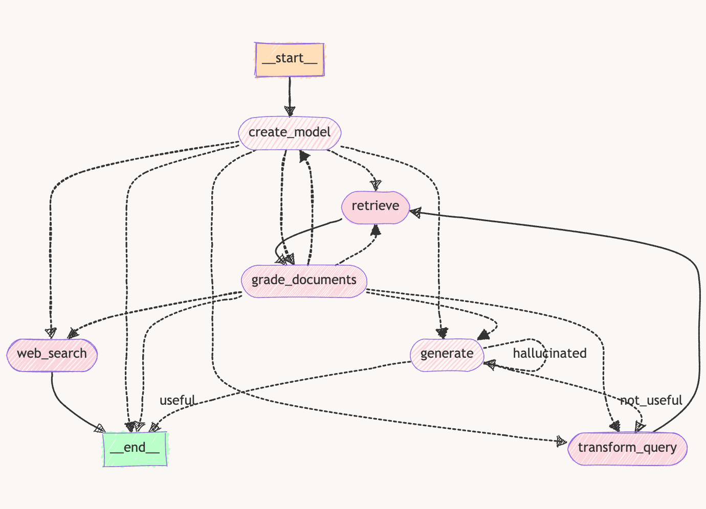
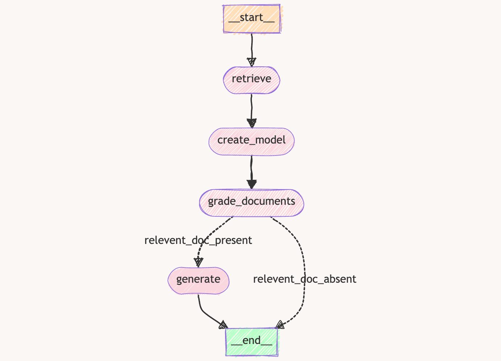

## Adaptive RAGs

### 1. RAG trained on LLM and Prompt Engineering content

This RAG performs the following operation:

- Loads the Open AI Model.
- Load and Index the document into a Memory Vector Store.
- Routes the question to the LLM Model if found relevant, otherwise perform a Web Search.
- Retrieve the indexed document from the Vector Store.
- Decide whether the retieved document is relevant to the question or not.
- If the document is relevant then ask model to generate answers for the question using the given context document.
- If the document is irrelevant, transform the question to get a better question/query and then re-grade the document with the updated question.
- Once the answer is generated, check the model for Hallucination and check how relevant the answer is to the question.

---
 
### 2. RAG trained on Coding Interviews content

